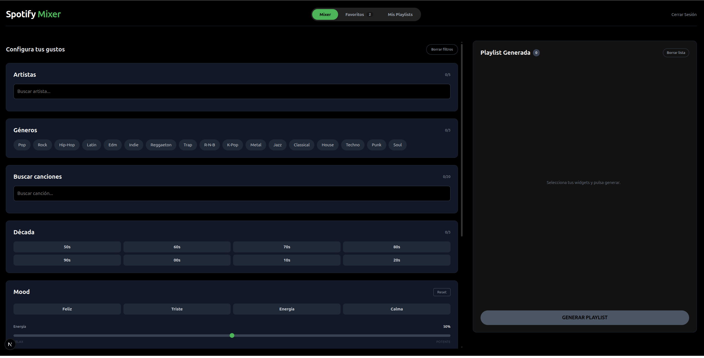
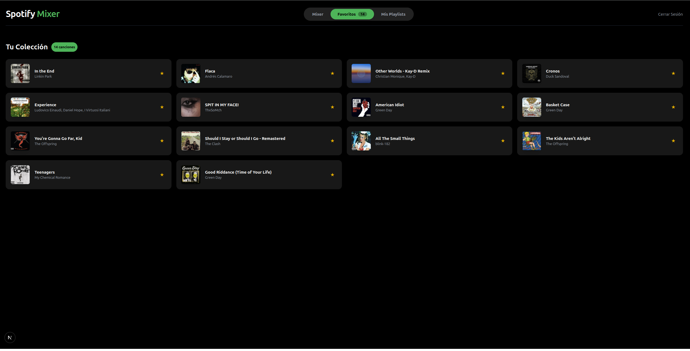
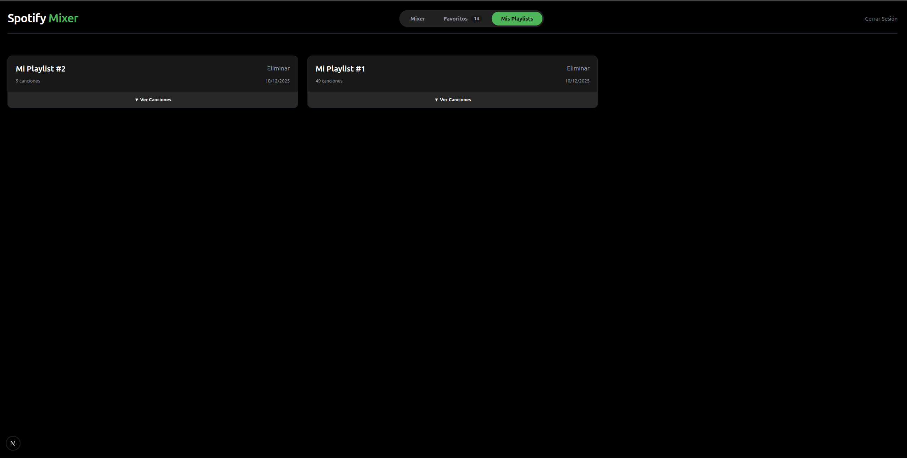

# Spotify Mixer

An interactive web app built with Next.js and Tailwind CSS that generates personalized Spotify playlists based on mood, decade, popularity and specific musical taste.

## Screenshots

## Features

**Mixer & Widgets**, a full control panel to filter music:
- Artist and genre multi-selection
- Mood Widget: custom algorithm that maps audio parameters (Energy, Positivity, Danceability) to compatible genres
- Popularity filter: from underground music to the Global Top 50
- Decade filter: 50s through 20s

**Playlist Management:**
- Smart generation algorithm that mixes results from different sources (artists, genres, mood) to create a varied list
- Save and manage playlists persistently via `localStorage`
- Mark individual songs as favourites

**UI/UX:**
- Native dark mode, responsive design
- Custom scrollbars (Spotify-style)
- Sticky headers and independent scroll areas

## How the Mood Algorithm Works

The standard Spotify search API does not support filtering by audio features (energy, valence) directly. The app uses a custom mapping approach:

1. The user adjusts sliders (0–100%)
2. The system translates values into internal "Ghost Genres"
   - `Energy > 80%` → adds `rock` and `edm` to the search
   - `Positivity < 20%` → adds `sad` and `piano`
3. These results are combined with selected artists to match the user's intended vibe

## Tech Stack

- **Framework:** Next.js 14/15 (App Router)
- **Styles:** Tailwind CSS
- **State:** React Hooks (`useState`, `useEffect`, `localStorage`)
- **Auth:** Spotify OAuth 2.0 with token refresh

## Project Structure

    src/
    ├── app/
    │   ├── api/
    │   │   ├── refresh-token/   # Token renewal endpoint
    │   │   └── spotify-token/   # Initial token endpoint
    │   ├── auth/callback/       # Spotify login redirect
    │   ├── dashboard/           # Main page (The Mixer)
    │   ├── globals.css          # Global styles and custom scrollbar
    │   └── layout.js            # Root layout
    ├── components/
    │   ├── widgets/
    │   │   ├── ArtistWidget.jsx
    │   │   ├── DecadeWidget.jsx
    │   │   ├── GenreWidget.jsx
    │   │   ├── MoodWidget.jsx
    │   │   ├── PopularityWidget.jsx
    │   │   └── TrackWidget.jsx
    │   ├── Favorites.jsx
    │   ├── Header.jsx
    │   ├── MyPlaylists.jsx
    │   ├── PlaylistDisplay.jsx
    │   └── TrackModal.jsx
    └── lib/
        ├── auth.js              # Token and session management
        └── spotify.js           # Search engine and generation algorithm

## How to Run

1. Clone the repo and install dependencies:

        npm install

2. Create a `.env.local` file with your Spotify credentials:

        SPOTIFY_CLIENT_ID=your_client_id
        SPOTIFY_CLIENT_SECRET=your_client_secret
        NEXTAUTH_URL=http://localhost:3000

3. Run the development server:

        npm run dev
